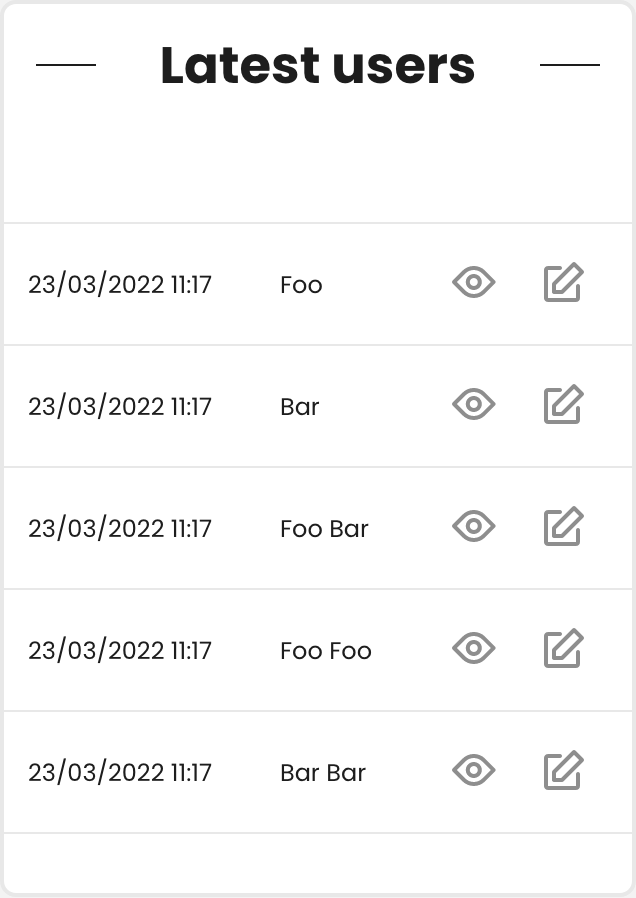

# Nova List Card

List rows in a table card. For example the 5 latest users.



## Installation

You can install the package in any app running [Laravel Nova](https://nova.laravel.com):

```bash
composer require thijssimonis/nova-list-card
```

## Usage

## Card
```php
<?php

namespace App\Nova\Metrics;

use App\User;
use ThijsSimonis\NovaListCard\NovaListCard;

class LatestUsers extends NovaListCard
{
    public $width = '1/2';

    public function __construct()
    {
        parent::__construct();

        $this->rows(User::select(['id', 'name'])->orderBy('created_at', 'DESC')->limit(5)->get()->map(function ($row) {
            $row['view'] = config('nova.path') . '/resources/users/' . $row['id'];
            return $row;
        })));
    }

    public function uriKey(): string
    {
        return 'latest-users';
    }
}
```

## Inline

```php
<?php

use App\User;
use ThijsSimonis\NovaListCard\NovaListCard;

class NovaServiceProvider extends NovaApplicationServiceProvider
{
    protected function cards(): array
    {
        return [
            (new NovaListCard())
                ->title(__('5 latest users'))
                ->rows(User::select('id', 'name')->orderBy('created_at', 'DESC')->limit(5)->get()),
        ];
    }
}
```

## Versioning

We use [SemVer](http://semver.org/) for versioning. For the versions available, see the [tags on this repository](/releases).

## Authors

* **Thijs Simonis** - *Initial work*

## License

The Laravel framework is open-sourced software licensed under the [MIT license](LICENSE.md).